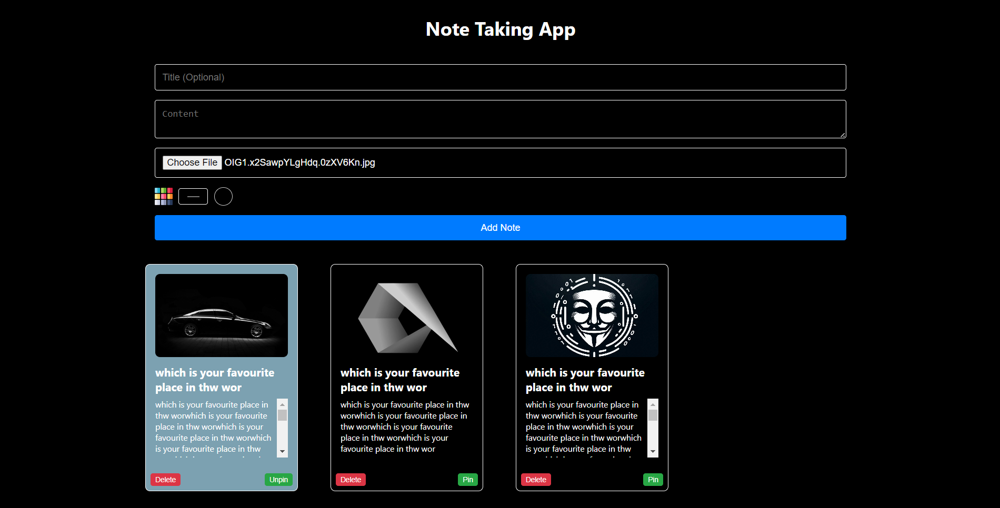

# Notes Application

Live URL : https://note-taking-app-react-ebon.vercel.app/

## Overview

Welcome to the Notes Application! This application allows users to create, manage, and organize notes efficiently. Each note can have a title, content, background color, and an optional image. Users can also pin important notes for quick access.




## Features

- **Create and Manage Notes:** Add new notes with titles, content, background colors, and images.
- **Pin/Unpin Notes:** Pin important notes to keep them at the top.
- **Delete Notes:** Remove notes that are no longer needed.
- **Responsive Design:** The application is fully responsive and works on various devices and screen sizes.
- **Image Upload:** Upload images to the notes using Cloudinary.
- **Custom Background Colors:** Choose custom background colors for each note.

## Technologies Used

- **React:** A JavaScript library for building user interfaces.
- **Redux:** A predictable state container for JavaScript apps.
- **TypeScript:** A typed superset of JavaScript that compiles to plain JavaScript.
- **Cloudinary:** A cloud-based image and video management service.
- **CSS:** Styling of the application.

## Installation

1. **Clone the repository:**
   ```bash
   git clone https://github.com/sKyi01/note-taking-app-react
  
   
## Install dependencies:

npm install

## Run the application:

  npm start

## Open your browser and visit:

http://localhost:3000


## Configuration

### Cloudinary Configuration:
1. Sign up for a Cloudinary account at [Cloudinary](https://cloudinary.com/).
2. Create an upload preset name.
3. Update the Cloudinary URL in the `NoteForm.tsx` file:
  
   const response = await axios.post(`https://api.cloudinary.com/v1_1/your-cloudinary-cloud-name/image/upload`, formData);

## Happy Coding !
